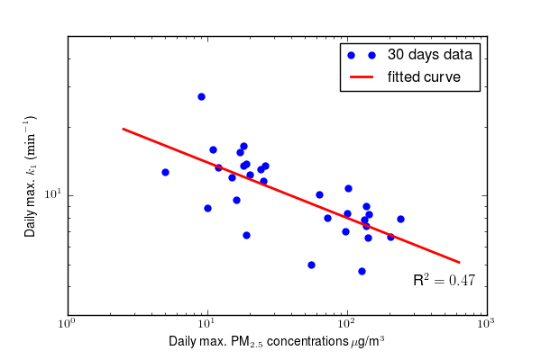
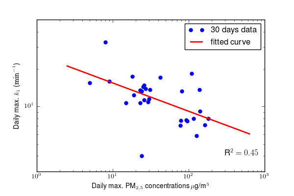

# Bay-Area-air-pollution-anaysis-after-camp-file
This project is for _**CEE263D: Air Pollution and Global Warming: HIstory, Science, and Solutions**_.

In this paper, we studied Bay Area air quality in the 3 weeks after the Camp Fire in November 2018. We discussed our data set from BAAQMD and methods in crawling, analyzing and modeling the data. Moreover, we presented our results and compared air quality in San Francisco and Redwood City. Specifically, our findings are:
+ PM2.5 concentrations at both locations increased by 10-fold during the pollution. Air pollution in San Francisco is little worse than Redwood City.
+ Calculations by two methods PSSA and Photostationary State Relation equation produce very close results on rate of reaction for photolysis of NO2 (this rate is denoted by k1 throughout the paper). San Francisco and Redwood City witnessed very similar trends in the study period for k1 values.
+ A closer look at k1 values of the week 19th to 26th revealed an interesting case where O3 concentration remained high and NO and NO2 stayed low overnight in San Francisco. A hypothesis was suggested that some other sources beyond the scope of this paper might have played an important role in the accumulation of O3 concentration. Also, the favorable condition introduced by the rainy weather of the week could have contributed.
+ A negative linear relationship was found between logarithm of daily maximum k1 values and logarithm of daily maximum PM2.5 concentrations at both locations. Confidence for both fittings are high and the coefficients were close. We used daily maximum to avoid noise in per hour data.

| |
|:--:| 
| *Linear fit between log PM2.5 and log k1 in San Francisco* |

| |
|:--:| 
| *Linear fit between log PM2.5 and log k1 in Redwood City* 
